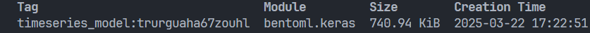
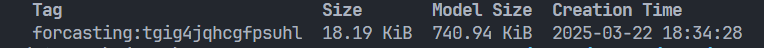

# Project: Triển khai mô hình DL bằng BentoML


## Giới thiệu

Dự án này nhằm triển khai mô hình học sâu (Deep Learning) sử dụng BentoML. BentoML là một framework mạnh mẽ giúp đóng gói và triển khai các mô hình học máy một cách dễ dàng và hiệu quả.

## Yêu cầu

- Python 3.10
- BentoML
- Tensorflow
- Keras
- Numpy
- Docker

## Cài đặt

1. Clone repository:
    ```bash
    git clone https://github.com/DoanDucThang0805/BentoML_serving.git
    cd BentoML_serving
    ```

2. Tạo và kích hoạt môi trường ảo:
    ```bash
    conda create -n myenv python=3.10
    conda activate myenv
    ```

3. Cài đặt các gói cần thiết:
    ```bash
    pip install tensorflow bentoml numpy
    ```
    Tham khảo cách cài tensorflow tại https://www.tensorflow.org/install/pip

4. Cài đặt Docker

    Tham khảo tại https://docs.docker.com/engine/install/
## Sử dụng

1. Chạy file save_model.py để load model vào bento
    ```bash
    python save_model.py
    ```

2. Kiểm tra xem model đã được lưu hay chưa
    ```bash
    bentoml models list
    ```
    

3. Triển khai service:
    ```bash
    cd src/backend_server/service
    bentoml build
    ```
    Sau khi hoàn tất kiểm tra bento đã tạo
    ```bash
    bentoml list
    ```
    

4. Containerize bento
    ```bash
    bentoml containerize forcasting:latest
    ```
    Sau khi hoàn tất run docker container
    ```bash
    docker images
    docker run -d -p 5001:3000 --name forcasting_service {image_name}
    ```
5. Test API

    Chạy file request_service.py
    ```bash
    python request_service.py
    ```

## Đóng góp

Nếu bạn muốn đóng góp cho dự án, vui lòng tạo pull request hoặc mở issue mới.
